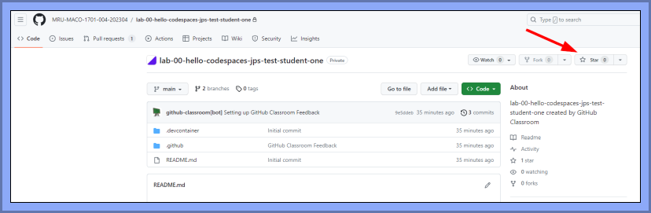
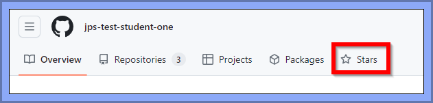
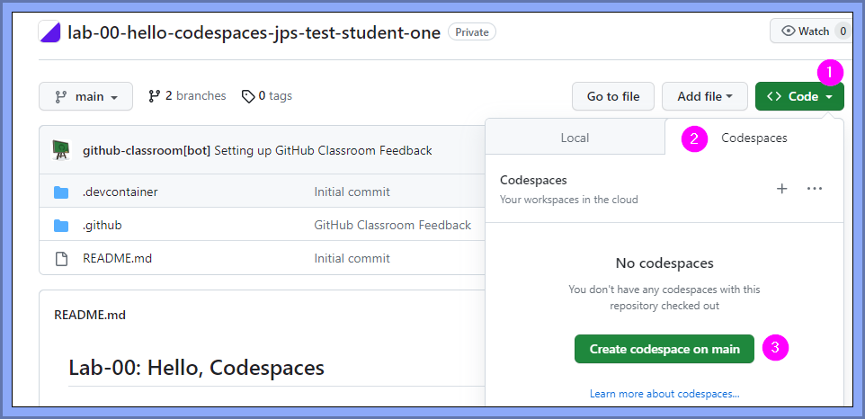
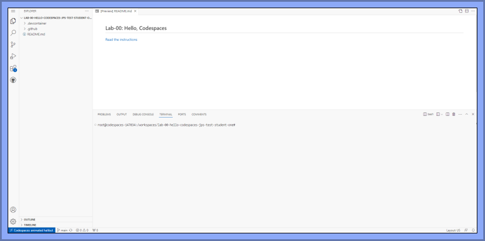
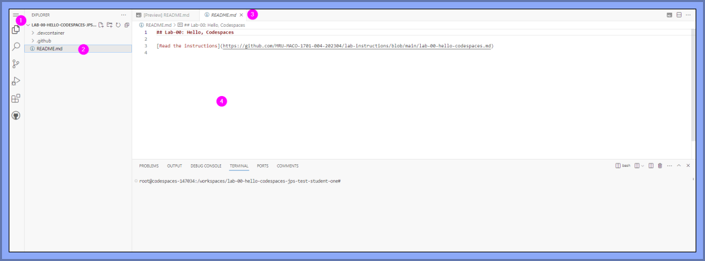
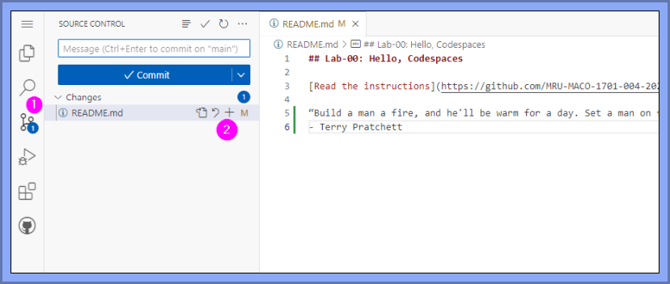
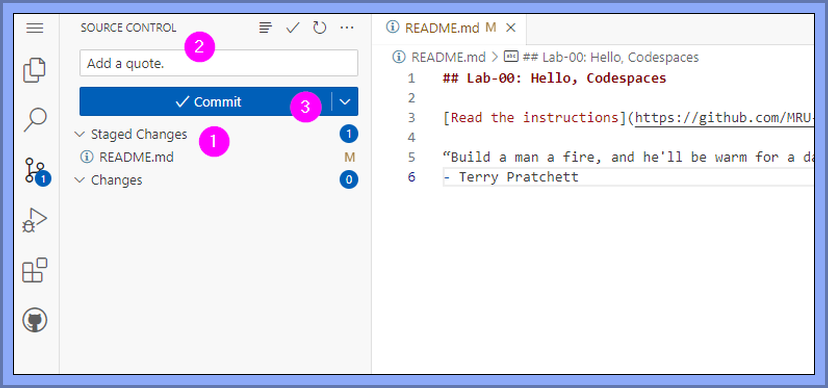
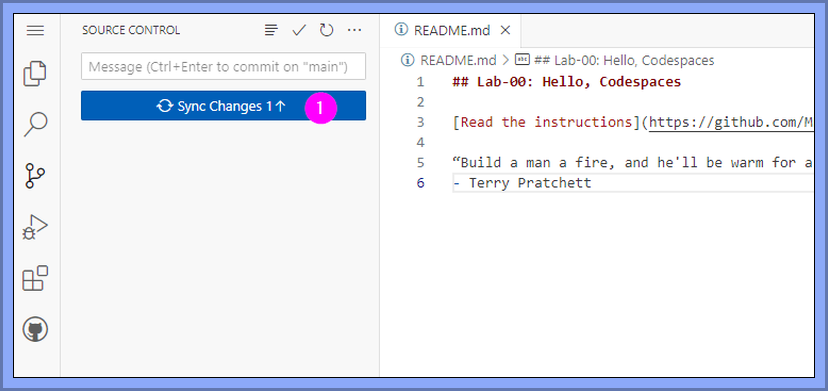
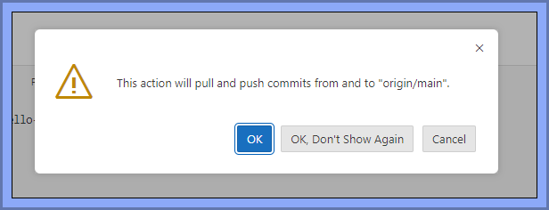
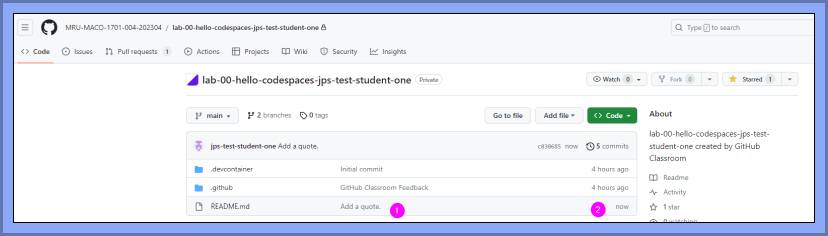

# Lab-00: Hello, Codespaces

**A brief encounter with GitHub Codespaces and GitHub Classroom.**

## What's a Codespace?

[GitHub Codespaces](https://github.com/features/codespaces) are "fully configured dev environments in the cloud", at least according to their PR department.

I tend to think of a Codespace as a little mini-computer I can access through a web-browser that has software I need for programming pre-installed on it. Which I guess is the same thing that the PR department is saying, but with more words. That's why I'm not in PR. 

## What's GitHub Classroom?

[GitHub Classroom](https://docs.github.com/en/education/manage-coursework-with-github-classroom/get-started-with-github-classroom/about-github-classroom) is a "teaching tool that lets teachers...create and manage...assignments". 

It's used by some instructors (like me) to distribute lab and assignment content.

## Overview

The steps below will introduce you to a workflow you will use with all labs - and most assignments - this semester.

The sooner you get the hang of this workflow, the better.

## Do These Things

These instructions aren't super-detailed, because such instructions tend to "rot" quickly. 
If you have any questions or issues, ask!

**You're not going to break anything by making a "wrong" choice here, so don't freak out.**

### Step 01: Get the content for this lab

**_First order of business: get your own copy of the content for the lab._**

1. Log in to GitHub.

2. Go to our [GitHub Classroom Content Links page](https://github.com/MRU-MACO-1701-004-202304/github-classroom-content-links).

    _**pro tip:** You're going to go here a lot, so bookmark it._

3. Click on the `get content` link for this lab to start [The Process](#the-process). 

4. Once your repo appears on the screen, click on the Star button to "star" it; this will make it much easier to get to it in the future. 

    

### Step 02: Open the content in a Codespace

**_Next up: create your own "mini-computer" to do your work._**

1. Go to your lab-00 repo. (If you just finished step 01, you should be there already, but if you've gotten turned around, go back to your GitHub home page and choose the Stars tab.) 

    

2. Click on the `<> Code` button ➀, then choose the Codespaces tab ➁, and finally click `Create codespace on main` ➂ 

    

3. Wait. (When you first create a Codespace, it'll take a while...but subsequent uses of that Codespace will be a **lot** faster.)

4. Feel somewhat underwhelmed by your new "computer": 

    

### Step 03: Make a change to the content on that Codespace

**_Let's change that `README.md` file, because it's pretty drab._**

Edit the `README.md` by...
1. ...selecting the Explorer icon ➀ ...
2. ...clicking the file name in the Explorer pane ➁ (which will open up the file in an editing tab ➂), and then...
3. ...typing some text in the editing area ➃. 

    _Type whatever you want...famous quote, recipe for guacamole, movie recommendation....the possibilities are endless._

    

### Step 04: Move the changes to someplace your instructor can see

**_You've changed the README on the "computer", but that doesn't help your instructor!_**

If you want your instructor to look at your work (you do), then you need to "push" the files from your "mini-computer" to your repo. _Your instructor doesn't have access to your mini-computer, but they **do** have access to your repo!_

1. Click on the `Source Control` icon ➀, then click on the `+` ➁ by the `README.md` file. This will...

    

2. ... move the file into the `Staged Changes` area ➀. Enter a brief, but useful message ➁ and click the `Commit` button ➂.

    

3. Click on `Sync Changes` ➀...

    

4. ...which pops up this ominous message that you can click `OK` or `OK, Don't Show Again`. 

    

5. In a few moments, the great pushing will be done. Shrug.

### Step 05: Sanity check

**_Let's make super-sure that your changes are visible to your instructor._**

1. Go back to your repo. If you're a bit confused over where you are, go back to your GitHub home page and choose the Stars tab: 

    

2. You should see that the `README.md` file is being displayed with your message and that the change was pushed shortly ago:

    

3. Mutter to yourself, "And I have to do this for _everything_?!?"

---

## The Process

When you click on the `get content` link, there is quite a lot that goes on behind the scenes!

It's not useful at this point to go into great detail, but here's a very high-level summary of this Process, without the technical mumbo-jumbo:

1. A copy of a template folder with the files and sub-folders necessary for the lab is created on GitHub. The name will end with **your** GitHub username.

2. You are given permission to **read** and **write* to this copied folder. But that folder does **not** belong to you - it belongs to your instructor.

We will use a special name for these "GitHub folders": **repo** (which is short for **repository**).
