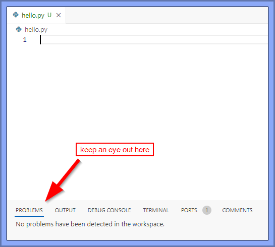
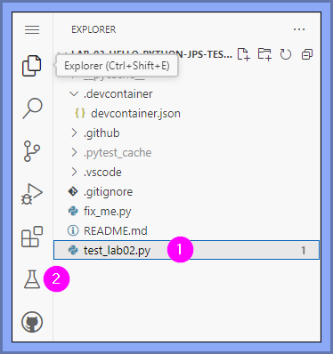
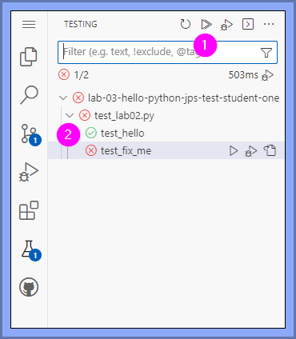
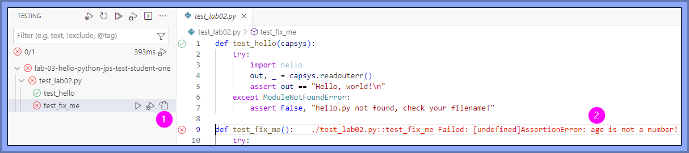
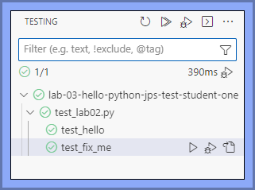

# Lab-03: Hello, Python

**Here we go.**

## Overview

Time to start using Python!

We're going to:

- Get even _more_ familiar with VS Code.
- Write and run your first Python program.
- Break some code, make note of error messages, and fix the breaks.
- Run automated tests on your code.

## Assumption

I assume you're now comfortable spinning up a Codespace, editing files on that Codespace, and pushing things you want me to see over to the associated org repo.

## Do These Things

### Step 01: Get ready to code

Create the Codespace for this lab as you've done for prior labs.

### Step 02: Do the following exercises

#### exercise-01: Hello, Python

1. Create a new **empty file** named `hello.py`. It's important that it's named _exactly that_, or the automated tests in exercise-03 below will go 'huh?!?!' and you will feel sad.

2. Run your code! There are (at least) three different ways to do this - try them all and see what you like best:
   1. Press the triangle "play button" at the top right of the VS Code editor.
   2. Press `Ctrl + F5` on your keyboard.
   3. In the integrated terminal, type the command `python hello.py`.
    
    *Running the code should do nothing at this point, but if you encounter an error, tell your instructor.*

3. Add Python code so that when you run `hello.py` again, you see the following in the terminal:
    ```plaintext
    Hello, world!
    ```
    > _Hint: the `print` function displays output to the terminal.
    Remember to save your file after making a change, either with File -> Save or the keyboard shortcut "Ctrl+S". Although your Codespace **should** be saving things automatically, you won't always be working on Codespaces and saving your hard work is **your** responsibility._

4. Experiment! Try each of the following changes one-by-one to see what happens, then undo that change and move on to the next. Remember to save and run your file after each change. Try to understand the error messages that appear, and don't hesitate to ask your instructor or IAs for an explanation.
   
    You should select the Problems tab while dealing with your error, as it can give you some hints as to what's going on.

    
   
   1. Add a space *before* your `print` command.
   2. Add a space *after* your `print` command, but before the `(`.
   3. Add a space after the `"`, but before the `H` in `"Hello, world!"`.
   4. Change the `p` in `print` to a capital letter.
   5. Add a comment (a line starting with `#`).
   6. Define a variable and print it instead of printing `"Hello, world!"` directly.

5. After experimenting, undo your changes so that your code prints `"Hello, world!"` again. In order to pass the automated tests (see exercise-03) it must be written *exactly* as required - not `"hello, world!"` or `"Hello, World!"` or any other variation.

---

#### exercise-02: Debugging

**Debugging** is the act of figuring out why code is not working the way it should - and then fixing the code so it does what you want. 

It's an incredibly important skill to develop, because you do it _all the time_ while programming.

Let's do some debugging:

1. Open the `fix_me.py` script in the editor.

2. **Predict** what will happen when you run the script. Don't skip this step, because it will help you build a muscle that you need to build! 

3. Now run the script. Something's weird with the result! What is it?

4. Fix the code so that it prints out your name, your age in years, and your age in months.

5. Where indicated, uncomment the code by deleting the # at the start of each line. (*Pro tip: You can also highlight all three lines and use the keyboard shortcut `Ctrl + /` to toggle the comments.*) Run the code again to see what happens.

6. Fix the code so that it now also prints out your year and program.

---

#### exercise-03: Run automated tests

Many languages - Python included - have one or more tools available to create **test code**. These tools let a programmer create code that *tests other code*. (Yes, it's very Inception.)

Now, you don't have to worry about writing this test code in COMP1701 - someone else has done that for you for your labs and assignments. But in future courses, you *will* be taught how to write such tests...and expected to do so for your assignments.

For now, let's practice running tests somebody else has made:

1. Select the `test_lab02.py` file in the Explorer (1) - this will cause the Testing icon (2) to appear in your sidebar:

    

2. After clicking on the Testing icon, you should see the Testing pane, where you can run all the tests by clicking on the double arrow icon (1), which will show the results of the tests (2):

      
    *Green checkmarks indicate a passing test; red x's indicate a failing test.*

3. If you have errors, you can click on the Go to Test icon (1), and the editor will open up with the error message shown (2):

      
    _These messages can be scary looking...but you should still read them, because they give you clues as to what the problem is!_

4. Try and "get to green" - get all the tests passing - by fixing your errors and re-running the tests. You eventually want to see this: 

      
    _All green!_

### Step 03: Push the work on your Codespace to the org repo

### Step 04: Confirm you pushed