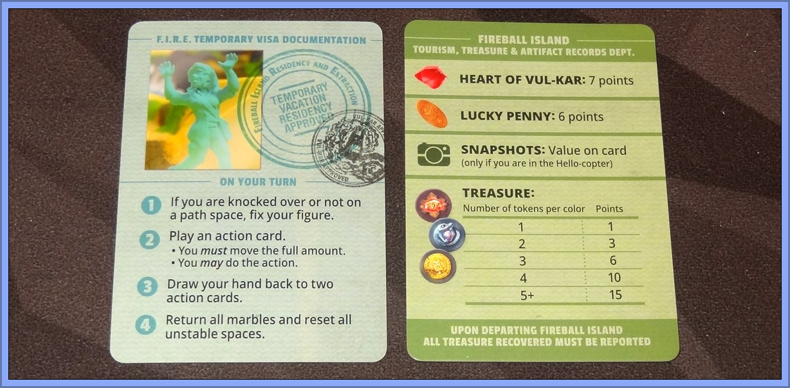
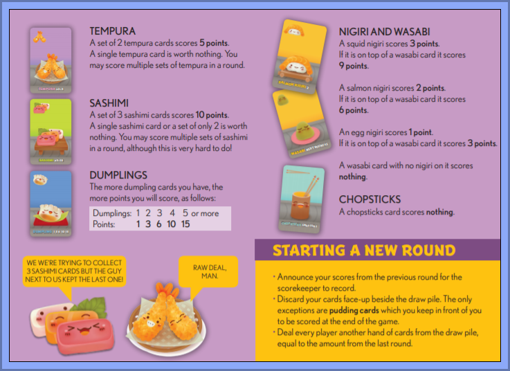

# Lab-09: Function Creation

**Time to give those function creation muscles a pounding.**

## Overview

This lab will give you practice creating a number of simple functions based on problem descriptions.
You'll be practicing:

- Figuring out simple problems to understand what's being asked of you.
- Writing simple value-returning functions, complete with type hints.
- Reading documentation on unfamiliar functions.

## Python language focus

The focus of this lab will be on:

- Writing valid Python functions that use type hints.
- Importing custom modules.
- Reading Python docs.

## Do These Things

You can do the following exercises in any order you wish. You will likely not be able to finish all of these in one lab sitting!

### DO THIS FIRST

There are automated tests in this Codespace...but they will not run properly until you've created the files and functions required by the test. Because of this, you should do the following before you begin:

1. Temporarily change the name of the 3 test files to something that doesn't start with the word "test". For example:
   1. `test_redactor.py` to `xtest_redactor.py`
   2. `test_triangular_scoring.py` to `xtest_triangular_scoring.py`
   3. `test_ability_score_generator.py` to `xtest_ability_score_generator.py`
2. When you are ready to test your given exercise, change the name of the appropriate test file back to what it was. You should then be able to test as before. For example, if you think your redactor exercise is ready to be tested, change the test file back to `test_redactor.py`.

### Exercise: Re****or

#### Preamble

re·dact/rəˈdakt/verb

- censor or obscure (part of a text) for legal or security purposes.

Censorship is fun! Let's make an object that redacts things.

#### Examples

> If we use the symbol '#' to redact the word "dog" from the text "my dog, dogbert, has doggone fleas!", we get "my ###, ###bert, has ###gone fleas!"
>
> _Note that we replace the text even if it's just part of a word (dogbert and doggone get replacements)._
>
> If we use the symbol '@' to redact the letter "i" from the text "My Sharona.", we get "My Sharona.", because there are no i's in the text.

#### Instructions

1. Create a file called `redactor.py`.

1. In the created file, create a function with type hints called `redact`. It should take in a string (the text to perform redaction upon), another string (the word to redact), and a yet another string (the symbol to use for redaction). **Assume that all text will be in lowercase form.**

   ```python
   # example usages
   
   redact("my dog, dogbert, has doggone fleas!", "dog", "#")
   # Return value should be: "my ###, ###bert, has ###gone fleas!" 

   redact("my sharona.", "i", "@")
   # Return value should be: "my sharona."

   redact("  spaces are a thing  ", " ", "*")
   # Return value should be: "**spaces*are*a*thing**"
   ```

1. Test `redact` by running the automated tests in the `test_redactor.py` file.

#### Hints & Suggestions

- You'll need to look up how to do string replacements. Real Python has a [nice bit on it](https://realpython.com/replace-string-python/#how-to-remove-or-replace-a-python-string-or-substring). Our textbook has a _bit_ about it as well.
- You'll also need to find the length of the string to redact, since you need to replace those with a string of redaction symbols of the correct length. Fortunately, you know how to do that, right?

---

### Exercise: Ability Score Generator

#### Preamble

In a role-playing game (or RPG), a player takes on the role of a character in a fictional setting. (https://en.wikipedia.org/wiki/Role-playing_game). The most famous RPG is Dungeons & Dragons, otherwise known as D&D.

When players create their characters in D&D, they roll dice to generate numbers that determine the abilities of their character. These numbers are called **ability scores**.

The process of generating a single ability score is as follows: four 6-sided dice are rolled, and the sum of the highest three dice are used.

##### Examples

> - roll a 4, 4, 6, 3? Toss out the 3 and sum the rest: 4 + 4 + 6 = 14
> - roll a 2, 5, 2, 2? Toss out one of the 2's and sum the rest for a score of 9.

#### Instructions

**Before you begin, take a look in dice.py - it has a function in it you will need to use for this exercise.**

1. Create a file called `ability_score_generator.py`.

1. Import `dice` at the top the script you created - you'll need ti for step 5.

1. In the created file, create a function with type hints called `highest_three`. It should take in four integers and return the sum of the highest three of those integers.

   ```python
   # example usage
   highest_three(1, 4, 2, 6)  # should return 4 + 2 + 6 = 12
   highest_three(1, 1, 1, 1)  # should return 1 + 1 + 1 = 3
   ```

1. Test `highest_three` by running the automated tests in the `test_ability_score_generator.py` file. When everything's passing, go to the next step.

1. Create another function with type hints, called `ability_score`. It should roll the dice 4 times, report what those rolled numbers were, and use `highest_three` to return the ability score. **Normally I would NOT suggest printing things out in a value-returning function. It is somewhat useful here, though, because it lets the user see what random numbers were rolled.**

   ```python
   # example usage
   ability_score()
   # Prints out something like:
   # "Rolled 2, 6, 1, 3"
   # and returns (in this example) 11
   ```

1. Test out your `ability_score` function by calling it a number of times in a script. You may also want to print out the result of the call - do you understand why?

#### Hints & Suggestions

- When faced with this problem, most students come at it thinking they need to find the 3 biggest numbers out of 4. That's definitely one way to look at it...but there's an easier way to solve the problem if you come at it from a different angle!
- Python has a [built-in function](https://docs.python.org/3/library/functions.html) called `min()` which is useful.

---

### Exercise: Triangular Scoring

#### Preamble

_I like board games._

_A lot._

_You'll see this as a recurring theme in numerous drills and assignments and test questions._

_I apologize in advance._

One thing I've noticed over the years playing (and losing at) games is that there is a common scoring pattern used in many of them. Let's take a look.

Here is a reference card for the awesome [**Fireball Island - The Curse of Vul-Kar**](https://boardgamegeek.com/boardgame/233020/fireball-island-curse-vul-kar) game:



See how points are scored for treasures?

Now here's a page from the rules of the equally excellent (albeit _very_ different!) card game, [**Sushi Go**](https://boardgamegeek.com/boardgame/133473/sushi-go):



Notice the dumpling scoring? It's the same as the treasure scoring!

This sequence (1, 3, 6, 10, 15....) is known as the [**Triangular Number Sequence**](https://www.mathsisfun.com/algebra/triangular-numbers.html).

_(Also, see how both games cap out at 15? You can imagine that for some games, this upper scoring limit might be higher...or lower.)_

Let's make a class that captures this common scoring mechanism.

#### Instructions

1. Create a file called `triangular_scoring.py`.

1. In the created file, create a function with type hints called `score`. It should take in a number of items to score and return the proper score (the associated triangle number).

   ```python
   # example usages
   
   score(0) # should return 0
   score(3) # should return 6
   score(5) # should return 15
   score(9) # should also return 15
   ```

1. Test `score` by running the automated tests in the `test_triangular_scoring.py` file. If you're passing all your tests, go on to the next step.

1. Create (and call!) a `main` function in your script file. In that `main`, reproduce the following table, using your `score` function. _Yes, this is much like what you did with the Incan Gold labs!_

   **Warning**: Calling `main` in your script file will cause the automated tests to break, unfortunately. Once you're happy that your table is printing out correctly, comment out the `main()` call, and things will work again.

   ```
   Name   Dumplings   Score
   Anh    2           3
   Miko   6           15
   Olga   5           15
   ```

#### Hints & Suggestions

- There is no need to use loops here...if you look at the Triangular Number link given to you above, you'll see that scoring can be done with a simple equation!
- There is no need to use an if-statement to handle the maximum score thing...take a look among the Python built-in functions for a function that you can use instead.


