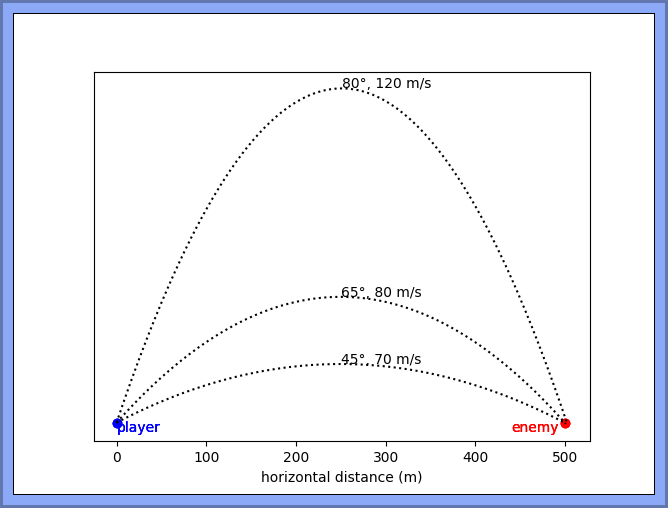

# Lab-11: Debugging, Testing, and Refactoring

**Lobbing things for fun and profit.**

## Overview

This tutorial gives you a chance to read some physics formulas, debug some code, make some functions, and generally have an absolutely _wonderful_ time.

## Python language focus

The focus of this lab will be on:

- Reading [NumPy/SciPy style docstrings](https://numpydoc.readthedocs.io/en/latest/format.html).
- Debugging Python in VS Code with the debugger.
- Improving existing Python code by extracting a helper function.
- Experiencing the usefulness of Python assertion statements.

## Backstory

Imagine your company is developing a turn-based tank battle game (like the classic [Scorched Earth](https://en.wikipedia.org/wiki/Scorched_Earth_(video_game)) game). Players take turns selecting a **launch angle** and **velocity** to launch a projectile at the other player, and the first to hit their opponent wins.

Unfortunately (well, for _you_), your co-worker has just won the lottery and quit, leaving you with some half-finished code and a half-hearted apology. They have written a function to compute how far a projectile will travel given a launch angle and velocity, but the code hasn't been tested yet and will likely need to be debugged. 

### A Bit of Useful Physics You Should Know About

Projectile kinematics (a.k.a. the science of lobbing stuff at far-away places) says that for a projectile launched on a flat surface, the flight-time (the time the projectile is in the air until it lands) satisfies this quadratic equation:

> ½ *g t*2 + *v* sin(*a*) *t* = 0
>  
> where:  
> *t* is the **flight time** in seconds  
> *a* is the **angle of launch**  
> *v* is the **velocity of launch** in **m/s**  
> *g* is the **acceleration due to gravity** (9.81 m/s2 on earth) 

Given velocity *v* and angle *a*, this equation can be solved for *t* using the [quadratic formula](https://en.wikipedia.org/wiki/Quadratic_formula).

Once you've calculated a value for the flight time (t), you can then find the horizontal distance travelled during that time with another formula:

> *x* = *v* cos(*a*) *t*
> 
> where:  
> *x* is the **horizontal distance** travelled  
> *v* is the **velocity of launch** in m/s  
> *a* is the **angle of launch**  
> *t* is the **flight time** in seconds

### What Your Co-Worker Left You

Your (ex)co-worker, being a competent developer, did some math on paper, and identified 3 trajectories (shown below) that would cause the projectile to travel 500 m. There's nothing magical about 500 m - it's just a round number that your ~~betrayer~~ co-worker chose.

_Note: The 80° and 65° trajectories don't exactly hit the 500 m mark - but they are "good enough" - we are talking explosive projectiles here!_

*Figure 1: Three sample trajectories that will cause a projectile to travel 500 m*

Your co-worker then made a function called `landing_point` to compute where a projectile will land - that is, the horizontal distance travelled by the projectile - if a launch angle and velocity are provided. The intent of the function is to accept a launch angle and velocity as parameters, use the [quadratic formula](https://en.wikipedia.org/wiki/Quadratic_formula) to compute *t*, and then use *t* to compute (and return) *x* using the equation above.

Being no fool, they also created some code to test their function...but then they hit it big and bailed on you.

You can find all the code left to you in **lab_11.py**.

## Do These Things

Do the following things in order.

### Part 1: Open the script file & clean up syntax errors

1. Open **lab_11.py** in your Codespace.

2. Does VS Code seem unhappy about anything? How can you tell?

3. Identify and fix the syntax issues with the file. **_There are 3 issues._**

    _You should understand **why** each error **is** an error...if you don't, that's something you'll need to add to your "to study" list._

#### Hints & Comments

- The `Type "None" cannot be assigned to type "float"` issue is not a real problem - it's being reported (incorrectly) because of another problem! This happens often with tools and is something you should be on the lookout for.
- You will notice that fixing one error can cause other errors to appear! This, too, is something you will want to remember.
- The last error you'll bump into is misreporting where the problem is - this is also something that will happen quite often! If you _swear_ there's nothing wrong on the reported line, a good thing to try is start looking _up line-by-line_ in the code until you find a line where the problem actually is....

---

### Part 2: Run the now-runnable code and see how it behaves

1. Run the code. 
   - What function is being called when you do that? What _that_ function calling? With what arguments?
   - Do you understand what the `test_with` function is doing? If you don't, stop and find out. You likely haven't seen the `assert` keyword before!

2. What error are you seeing in the traceback? Does it make sense to you?

#### Comments

- I hope you see how useful `test_with` and `test_scenarios` are - just by running the script, we can tell immediately whether our `landing_point` function is actually working as expected!
- You should start using this kind of technique in your own code going forward. It may seem like unnecessary work, but the amount of time it saves you in the long run is _amazing_.

---

### Part 3: Track down the logic errors

Here comes the fun part: figuring out _why_ the code currently in `landing_point` is broken! The errors you're looking for now are **logic errors**, which are usually a lot harder to fix than **syntax errors**. Harder - but not impossible, especially once you gain experience.

**There are 4 logic errors in the script - 3 errors in `landing_point` and one...elsewhere.**

1. Find the 4 logic errors and fix them so that `test_scenarios` now runs without error.

2. We want to be fairly certain we've fixed the bugs, so add two more calls to `test_with`, using the values from Figure 1. Run the script again and confirm that everything still runs without error.

#### Hints

I usually suggest students ask themselves these questions - in order! - when trying to track down logic errors:

1. What don't you like about what is showing up in the terminal?
1. Does a quick skim of the code reveal anything unusual about the code? _Human brains are pretty good at seeing things that are out of place, so you should give this a try. As you gain experience, this quick step can prove very effective in finding bugs!_ 
1. What line of code prints that thing you don't like?
1. What line of code assigns a value to the variable that has the incorrect value? AND WHAT IS THE CORRECT VALUE?
1. What function is providing that wrong value?
1. Where does that function return the wrong value?
1. Where is that wrong value calculated? And what does that mean about the variables involved in that calculation?
1. How can you confirm that those variables are what you think they are? AND WHAT DO YOU THINK THEY ARE?

These questions force you backward from the point where something "bad" is happening, to the cause of that badness - the cause of the logic error.

#### Using the Debugger

Debuggers let you "pause" the code to see the values of variables at different points of the code execution.

Most debuggers work in the same way:
1. The developer places a **breakpoint** - a place to pause execution - on a line of executable code in the editor. _Hint: a good place to put a breakpoint is on the line that is displaying something you don't like._
2. The developer runs the debugger in a special debug mode.
3. The debugger runs the program and pauses on the line with the breakpoint, displaying the value of all variables in scope at that time.
4. If the developer wants, they can then have the debugger execute the program line-by-line.

You will likely find it useful to use the debugger to track down the logic errors, but be warned: using the debugger is a waste of time if you do not know what values variables are supposed to have during the code execution! That means you need to figure out these values by hand - so do that before you use the debugger.

---

### Part 4: Improve the code

A good habit to get into is to **improve code that's working**. This process is known as **refactoring**. (You don't need to remember that term...but it _is_ a common term in industry, so knowing it makes you look cool.)

Let's do a little refactoring!

1. The quadratic formula used to calculate `t` in our program has `c = 0`, which means that formula simplifies quite a bit. Why don't you simplify the t calculation - and then make sure those tests still pass!
1. The `landing_point` function is doing quite a bit of work - it's both calculating the flight time AND using a flight time to calculate a distance. We should create 2 functions that do those 2 things and have `landing_point` call those functions:
   1. Define a new function with a reasonable name that calculates the flight time. What parameters should it have?
   2. Paste the code from `landing_point` into this new function's body.
   3. Call this new function from `landing_point` and store the value in `t`.
   4. Run the program to test that you haven't busted anything.
   5. Now do something similar to create and call a new function that calculates the distance travelled from `t`.
   6. Run the program to test that you haven't busted anything.

---

## Things That Help You Find Bugs

Here's a non-exhaustive list of things you can do to track down errors:

 - [ ] visual inspection
 - [ ] letting the IDE highlight syntax errors
 - [ ] checking whether code implements the intended functionality
 - [ ] manual code tracing
 - [ ] commenting out some lines of code to simplify the program
 - [ ] adding `print` statements to print out intermediate results for inspection
 - [ ] using breakpoints and IDE debugger to step through the code
 - [ ] calling a function with test inputs to check its functionality
 - [ ] anything else not on this list?