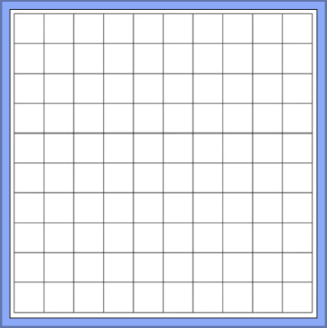
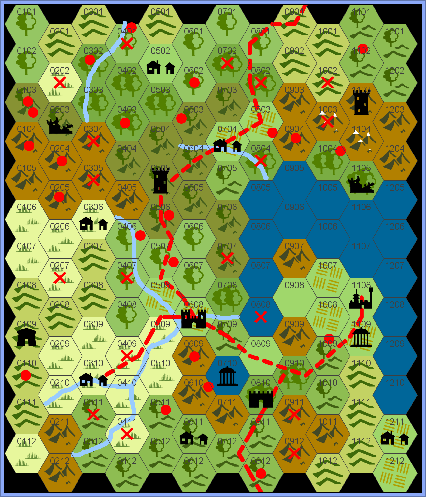

# Lab-14: Functions with Decisions

**Will this be enjoyable? Only one way to decide...**

## Overview

This lab will give you practice working with decisions. In particular, you will need to design - and use - a number of boolean-returning functions that involve branching to help solve a larger problem.

## Do These Things

These exercises can be done in any order.  
The second one is challenging...but the first one has a few teeth as well. :)

### Exercise: Spaces Between

**Instructions** 

Create an application in `spaces_between_app.py` that behaves like this:

1. It should prompt for two letters, one after the other.
2. It should inform the user how many letters are **between** the given letters. In addition:
    - If the second letter comes **before** the first letter in the alphabet, the output will 'correct' the order - see **Sample Run 2** for an example of this.
    - The output will use proper grammar depending on the number reported - compare **Sample Run 1** with **Sample Run 3**, for example. 

You can assume that the user will enter in only a single letter of the alphabet - but you **cannot** assume they will enter a lowercase letter, and your code must deal with this. See **Sample Run 5** for example output in the case where uppercase letters are provided.

Your solution should at the very least use one function other than `main()`: a function that takes in two letters and returns an integer representing how many letters are between the given letters.

You should test your code with a variety of different inputs and confirm that the results are what you expect. You should practice testing your functions using the different methods (in a REPL or using `assert`) we've illustrated in lecture and lab, too!

**Hints**

Wondering how to see how far apart two letters are? Or how to tell if one letter comes before another? Do me a favour: try these in a REPL:

<pre>
>>> ord('a') - ord('b')
>>> ord('b') - ord('a')
>>> ord('a') < ord('b')
>>> ord('b') < ord('a')
</pre>

_`ord()` is a built-in Python function. Look it up!_

To deal with the upper/lowercase letter issue, look up Python's `lower()` method.

Here are some sample runs of a properly-working application:

**Sample Run 1**

<pre>
Please enter a letter: <b>f</b>
Please enter a letter: <b>k</b>
There are 4 letters between f and k.
</pre>

**Sample Run 2**

<pre>
Please enter a letter: <b>k</b>
Please enter a letter: <b>f</b> 
There are 4 letters between f and k. 
</pre>

**Sample Run 3**

<pre>
Please enter a letter: <b>a</b>
Please enter a letter: <b>c</b>
There is 1 letter between a and c.
</pre>

**Sample Run 4**

<pre>
Please enter a letter: <b>k</b>
Please enter a letter: <b>k</b>
There are 0 letters between k and k.
</pre>

**Sample Run 5**

<pre>
Please enter a letter: <b>K</b>
Please enter a letter: <b>L</b> 
There are 0 letters between k and l.  
</pre>

---

### Exercise: Hex Grid

**Heads-up: this is a challenging sucker - in some ways, you could consider this a mini-assignment! Feel free to putter with it over the course of a number of days (weeks?). If you manage to get this done quickly, my hat's off to you!**

You are likely familiar with standard graph paper:

 

Perhaps you are not so familiar with hex paper - it's often used for creating outdoor maps in a variety of role playing and war games. 

Here is an example map (from [Beyond Fomalhaut](https://beyondfomalhaut.blogspot.com/2021/11/blog-hex-crawls-simple-guide.html)) using hex "paper":

You'll see that in this map, each hex is numbered with a 4-digit number (like 0305): the first 2 digits indicate the **column** and last 2 digits indicate the **row** of the hex. The first hex is 0101 and is traditionally placed in the top left of the map, as we see in the above map. 

If we consider the top of the grid to be North, then you can see there are 6 ways to "leave" a given hex to "travel" to another: 
1. north (or N)
1. northwest (NW) 
1. northeast(NE) 
1. southwest(SW)  
1. southeast(SE)
1. south(S)

**Instructions** 

Create an application in `hex_grid_app.py` that tells a user what hex they will wind up on in the above map if they start on a given hex and travel in one of the allowable directions. To be more specific:

1. The application will prompt for a location in `ccrr` format (cc = 2-digit column, rr = 2-digit row). See **Sample Runs 1 - 5** for examples. You can assume the user will enter 4 digits when prompted for a location.
2. If the entered location is on the map above, the application will continue to step 3; otherwise, it will display a useful error message and stop. See **Sample Run 3**.
3. The application will prompt for a direction to travel. See **Sample Runs 1 and 2** for examples.
4. If one of (`N`, `NW`, `NE`, `SW`, `SE`, or `S` - _case insensitive_) is entered, the application will continue to step 5; otherwise, it will display a useful error message and stop. See **Sample Run 4**.
5. If movement in the given direction results in a hex that is still on the map, that hex's coordinates are displayed. Otherwise, a message is displayed. See **Sample Runs 1,2, and 5**.

**Hints**

 - There's a reasonably simple pattern involved when you move from one hex to another - but there is a wrinkle.....I suggest picking a starting hex in an EVEN column and noting its neighbours' numbers. Then choose a starting hex in an ODD column number and see if you notice any important differences...

- I've provided a number of helper functions in `hex_grid_app.py`. Read their documentation to see what they do for you. Use them if you'd like. (They will definitely make your life easier!)

**Sample Run 1**
<pre>
Where are you? <b>0305</b>
What direction do you want to go? <b>ne</b>
...trudge trudge trudge...
Whew. You've finally arrived at 0404.
</pre>

**Sample Run 2**
<pre>
Where are you? <b>1008</b>
What direction do you want to go? <b>S</b>
...trudge trudge trudge...
Whew. You've finally arrived at 1009.
</pre>

**Sample Run 3**
<pre>
Where are you? <b>0009</b>
I have no idea where you are! Bye!
</pre>

**Sample Run 4**
<pre>
Where are you? <b>0305</b>
What direction do you want to go? <b>e</b>
I don't know the direction 'e'! Bye!
</pre>

**Sample Run 5**
<pre>
Where are you? <b>1211</b>
What direction do you want to go? <b>se</b>
...trudge trudge trudge...
Oh noes! You've wandered off the map!
</pre>