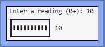

# Lab-17: More Loopy Functions

**The adventure continues...and continues...and continues....**

## Overview

Time to make a couple of mini-applications that involve a number of smaller loop-driven helper functions. You'll get to loop through a string with a `for` loop for one of them.

## Do These Things

These exercises can be done in any order.  

### Exercise: The Gauge

#### Background

A gauge is meant to visually display a reading of some sort. Examples of readings are things like intensity of sound (decibels), or speed (km/h), or radiation levels (rads).

Gauges are limited in the sense that they can only display some maximum value, even though the reading itself might be over that maximum. **For our app, this maximum value is 10.**

#### Instructions

Build an app in `the_gauge.py` that behaves as follows:

1. It prompts the user for a **reading**: an integer >= 0. This reading will be validated (see Example 2).
2. It displays the gauge, with a number of bars equal to the reading value entered. In addition, if the reading provided is >10 (see Example 4):
   1. Only 10 bars will be displayed, and
   2. An asterisk will be displayed next to the reading value.

Look at the helper functions that have been provided for you in `the_gauge.py`. They will make your task easier.

#### Restrictions

1. Although you _could_ use the string repetition operator (*) to create the bars in the display, don't. Use a `while` loop instead, to practice using loops - and because you won't get to use the operator in the languages you'll be using next semester!
2. Create a variety of helper functions instead of piling all your code into `main` (or worse, as just a bunch of code NOT inside main). At the very least, create a function to get valid input from the user and another to display the gauge.
3. Use this character as your bar: ❚  (just copy and paste it into your code).

#### Examples

_example 1_  

_example 2_  

_example 3_  

_example 4_  

---

### Exercise: Voweliness Comparison

#### Background

You're working on a text-analysis program (very hush-hush) that, among other things, analyzes text to see how "vowely" it is - this is a totally made-up word meaning "how many vowels - aeiou - are in it."

You've decided to make a simple test program to help you out with this task.

#### Instructions

Build an app in `vowlier.py` that behaves as follows:

1. It prompts the user for the first word - this is the word that all other words entered will be compared to.
2. It prompts the user for a word to compare to the first word, or to press Enter by itself to stop processing.
   1. If the user presses Enter by itself, the program displays a thank you message and ends; otherwise,
   2. A message describing the comparative voweliness is displayed.

**Assume that all vowel comparisons are case-insensitive.**

#### Restrictions

1. You must create at least two helper functions: one that determines whether a given string is a vowel, and one that returns the number of vowels in a given word. This second function must use a `while` loop.
2. You must test your helper functions with a variety of assert statements; after you are convinced your helpers are working, you can comment the asserts out.
3. Once you've successfully completed your program, re-do the function that returns the number of vowels in a word using a `for` loop instead of a `while`. Re-test that function to convince yourself it's working as before.

#### Hints

1. The Python method `isalpha()` is very useful here.

#### Examples

_example 1_  
<pre>
What's the first word? <b>adios</b>
Enter a word to compare; or Enter by itself to stop: <b>see</b>
'see' is not as vowely as 'adios'
Enter a word to compare; or Enter by itself to stop: <b>PONTIFICATE</b>
'PONTIFICATE' is vowlier than 'adios'
Enter a word to compare; or Enter by itself to stop: <b>TooNey</b>
'TooNey' is the same vowlieness as 'adios'
Enter a word to compare; or Enter by itself to stop: 
Thanks for voweling!
</pre>

_example 2_  
<pre>
What's the first word? <b>right</b>
Enter a word to compare; or Enter by itself to stop: 
Thanks for voweling!
</pre>